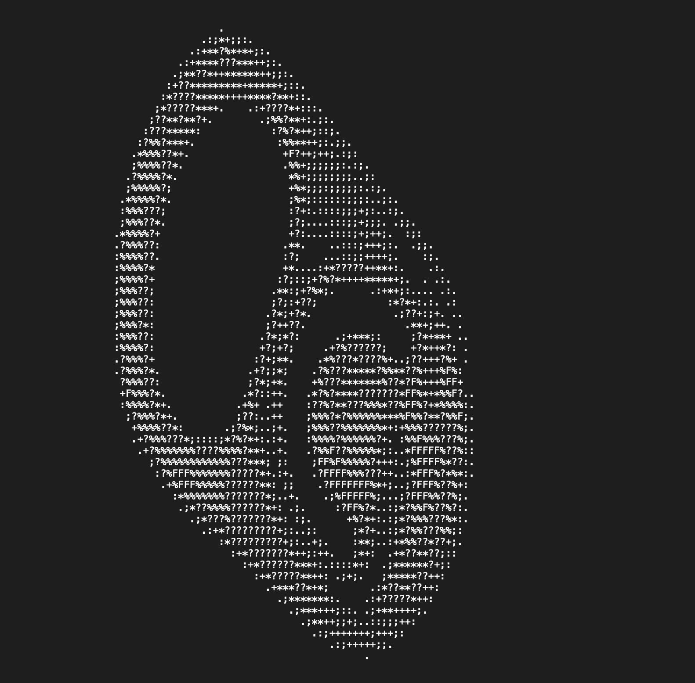

# ascii-generator
An open-source tool to convert images into ascii art.

**manual for macOS terminal**

1. save the file on desktop or in another directory

2. change directory 
`cd your directory`

3. start the program
`python3 script.py`

4. enter the name of a file, you want to convert
`example.jpg`

5. change characters in the array to change the output
`ASCII_CHARS = ["‹","!","#","Ç","-","_","#","?","“","≠"," "]`

**note:** you have to use a monospaced font with the same font size (pt) 
and line height (pt), if you paste the output somewhere 

the output might not be formatted as you wish, you either have to adjust 
the code or paste the txt into an editor

## examples

